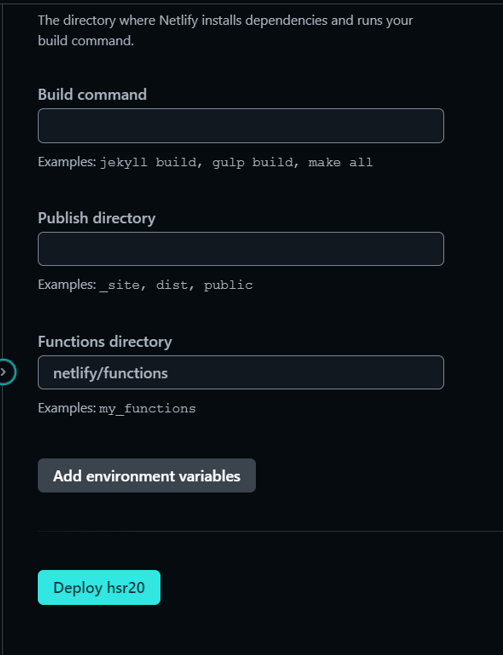

HSR 2.0 Characters
==================
Black Swan
----------

Black Swan in Honkai: Star Rail is an enigmatic Memokeeper of the Garden of Recollection.  
She possesses the unique ability to preserve and share memories, making her an invaluable asset to those who seek to understand the past.  
While her true origins remain shrouded in mystery, Black Swan's enigmatic presence and powerful abilities have garnered her both admiration and fear.  
Outside of the references in Simulated Universe, we have very limited information about her origins.

### Her Roles in the Game

*   Waifu
*   DoT
*   Wind DPS

### Her Skills

1.  #### Basic Skill:
    
    Percipience, Silent Dawn
2.  #### Skill:
    
    Decadence, False Twilight
3.  #### Ult:
    
    Bliss of Otherworld's Embrace

Black Swan Character Trailer
----------------------------

Sparkle
-------

A member of the Masked Fools. Inscrutable and unscrupulous.  
A dangerous master of theatrics engrossed in playing roles.  
A woman of countless masks and many faces. Wealth, status, power...  
None of this matters to Sparkle.  
The only thing that can lure her interest is "amusement".

### Her Roles in the Game

*   Buffer
*   Quantum Element
*   Skill Points Generator

### Her Skills

1.  #### Basic Skill:
    
    Red Herring
2.  #### Skill:
    
    Dreamdiver
3.  #### Ult:
    
    The Hero With Thousand Faces

Sparkle Character Trailer
-------------------------

Who are you choosing to pull
----------------------------

 Black Swan  

 Sparkle  

Name:  
  

Reason:  

  

Copyright © COGNOSPHERE. All Rights Reserved.

Deployed Site:
--------------
[Link](https://geraldrizky-hsr-module1.netlify.app/)
=======

## Deployment Process
1. Make sure all your code is pushed up to Github on the branch you want to deploy e.g.`Main`
2. Navigate to https://app.netlify.com/
3. Login/Create an account with Github

1. Click `Add new site` and `Import an existing project`

5. Select `Deploy with Github`

6. Netlify will ask you to authenticate with GitHub
7. Select the repo that you want to deploy
8. Review the configurations as are shown below and click **Deploy "Site Name"**

9. Deployments are [triggered automatically](https://www.netlify.com/docs/continuous-deployment/) by every git push to the `main` branch of the origin repository.

### Buying and Setting up a custom domain

1. Go to https://www.niagahoster.co.id/domain-murah or any other domain registrar
2. Purchase your custom domain name

3. Navigate back to https://app.netlify.com and select your site
4. Navigate to `Set up a custom domain`.
5. Add your custom domain to your site

6. Netlify will display a modal providing instructions on how to update your DNS/Nameservers
7.  Update your DNS/Nameservers in the domain registrar site to the modal given by netlify

8. Wait for your external DNS/Nameservers to be verified

9. Once verified, visit your domain to verify that it's working

## Site should be good to go!